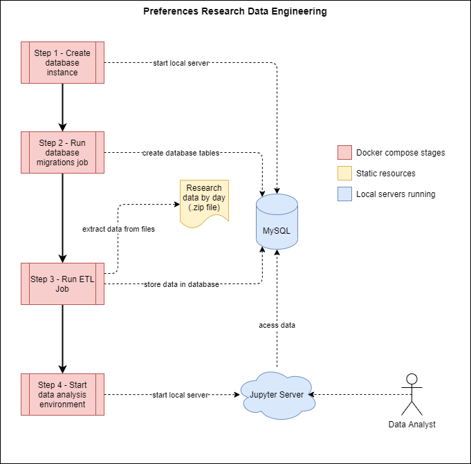

# Preferences Research Data Engineering

📑 Data engineering to collect, transform and store preferences research data.



## Context

This project is an extension of a [practice activity](./docs/problem_statement.pdf) of [IGTI's Data Engineering Bootcamp](https://www.igti.com.br/bootcamp/engenheiro-de-dados). It consists in use of Python to extract data from a [.zip](./data/research_datasets.zip) of **.csv** files, where each file represents a series of personal preferences research data collected at a given day, and store it in a MySQL database.

I choose to use it to learn [Alembic](https://alembic.sqlalchemy.org/en/latest/), a tool to perform database migrations, used in this case to create database structure, and also to understand how to package migrations and ETL *jobs* with [Docker](https://www.docker.com/), allowing running data analysis only after database structure is ready and data is stored on it.

## Reproducing analysis

This project's [Docker Compose file](./docker-compose.yml) is configured to create the database structure, run ETL job and then setup a Jupyter environment to perform data analysis. So, considering you have it installed in your machine, all you need is run the following commands in a terminal window:

1. Clone repository:

```
$ git clone https://github.com/lucasfusinato/preferences-research-data-engineering
```

2. Open project's folder:

```
$ cd preferences-research-data-engineering
```

3. Start containers:

```
$ docker-compose up -d
```

And that's all! Now, you should be able to access Jupyter Server and initial analysis by clicking on [this link](http://localhost:8888/?token=7f345d77-dd98-4054-bc00-f3385e6533db).

## Built with

- [Docker Compose](https://docs.docker.com/compose/): Docker container's run specification tool, is responsible here to run migrations and etl jobs before prepare notebooks analysis environment;
- [Jupyter](https://jupyter.org/): notebook execution environment;
- [MySQL](https://www.mysql.com/): open-source SQL SGBD;
- [Pandas](https://pandas.pydata.org/): Python data analysis' package;
- [Alembic](https://alembic.sqlalchemy.org/en/latest/): Python database migrations' package.